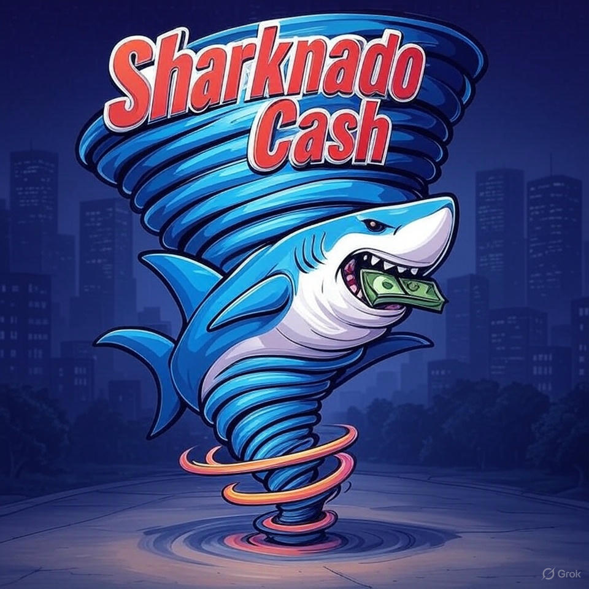

# 🌪️ SharknadoCash - Synthetic Monero (sXMR) Token System 🔒



## 🔐 What is Monero and Why it Matters

Monero (XMR) is a leading privacy-focused cryptocurrency that provides strong anonymity guarantees through ring signatures, stealth addresses, and RingCT technology. Unlike Bitcoin and most other cryptocurrencies, Monero transactions are completely private by default - hiding the sender, recipient, and transaction amount from public view. This makes Monero the gold standard for financial privacy in the cryptocurrency space.

However, Monero's privacy features come at a cost - it cannot directly interact with smart contract platforms like Ethereum or other EVM chains, limiting its utility in the growing DeFi ecosystem.

## 🚀 Revolutionizing Web3 Privacy

SharknadoCash bridges this gap by bringing Monero's privacy guarantees to EVM chains through synthetic Monero (sXMR) tokens. Unlike other privacy solutions on Ethereum (such as Tornado Cash), SharknadoCash leverages Monero's battle-tested privacy infrastructure, providing:

- **🛡️ Stronger Privacy Guarantees**: Built on Monero's privacy technology, which has withstood years of scrutiny
- **👥 Larger Privacy Set**: Benefits from Monero's entire user base rather than just a specific mixer pool
- **🔗 Decentralized Verification**: Uses cryptographic proofs to verify Monero transactions without centralized intermediaries
- **🌉 Cross-Chain Privacy**: Enables private value transfer between Monero and any EVM-compatible blockchain

## 🔍 Overview

SharknadoCash is a system for creating and managing synthetic Monero (sXMR) tokens on EVM-compatible blockchains. The system allows users to mint sXMR tokens backed by collateral, with the price of Monero determined by a Pyth price oracle. Additionally, our bridging system enables 1:1 sXMR to XMR transfers using vLayer's Web Proofs for verification of Monero blockchain transactions.


**[Try our live demo](https://sharknado-cash.vercel.app/)** to experience the prover system for cross chain swaps


**[Try our live demo](https://fungerbil.com/sharknado/index.html)** to experience the mint/burn interface for sXMR tokens.

## 📁 Repository Structure

The repository is organized into the following main directories:


### 📂 `/backend`
Server implementation for the bridge between sXMR and Monero:
- Node.js/Express server that handles bridge operations
- Connects to Monero nodes for transaction verification
- Manages API endpoints for the frontend to interact with

### 📂 `/frontend`
Frontend implementation for the bridge interface:
- Vue.js-based web application
- User interface for minting sXMR, managing collateral, and performing swaps
- Connects to the backend API and smart contracts

### 📂 `/contracts`
Smart contract implementations organized into several key modules:

#### 📂 `/contracts/interfaces`
Contract interfaces and abstract contracts:
- Defines common interfaces for system components
- Ensures consistent implementation across contracts

#### 📂 `/contracts/lspSyntheticMonero`
Liquid Stability Pool integration for sXMR:
- `LSPAdapter.sol` - Connects to Bera Borrow's LSP and manages liquidity flow
- `LSPSyntheticMonero.sol` - Enhanced sXMR token with LSP integration
- `sXMRLiquidator.sol` - Efficient liquidation process using LSP liquidity
- `CrossChainSXMR.sol` - Cross-chain functionality for sXMR

#### 📂 `/contracts/sXMRVlayer`
vLayer integration for Monero transaction verification:
- Implements vLayer Web Proofs (zkTLS) for trustless verification
- Contains the MoneroNodeVerifier contract
- Includes test scripts and fixtures

### 📂 `/layerZeroBasicContracts`
Implementation of LayerZero protocol integration:
- Enables cross-chain messaging and token transfers
- Supports bridging sXMR across multiple EVM chains

### 📂 `/monero_tx_Server`
Monero transaction verification server:
- Connects to Monero stagenet node
- Verifies transaction details using the Monero wallet
- Provides verification endpoints for the bridge

## 🧩 Key Components

### 💎 SyntheticMonero (sXMR) Token

A collateral-backed synthetic asset that tracks the price of Monero (XMR). Features include:

- Minting sXMR by depositing collateral
- Burning sXMR to redeem collateral
- Collateralization ratio management
- Integration with Pyth price oracle for XMR/USD price feeds

### 🔄 MoneroSwap

A contract that enables 1:1 swaps between sXMR and real XMR. The process works as follows:

1. Alice locks her sXMR in the contract, specifying her Monero address
2. Bob pays Alice's Monero address with real XMR
3. Bob provides proof of this payment using vLayer Web Proofs and in doing so claims the locked sXMR from the contract

### ✅ MoneroNodeVerifier

A contract that verifies Monero transactions using vLayer's Web Proofs (zkTLS). This enables trustless verification of off-chain Monero payments within the EVM environment and executes the payment to the proof provider.

### 🏦 LSP Integration (Liquid Stability Pool)

The LSP integration provides several key benefits for the sXMR system:

- **Enhanced Liquidity**: Provides deep liquidity for efficient liquidations
- **Capital Efficiency**: Reduces collateralization requirements
- **Stability Mechanism**: Acts as a backstop during market volatility
- **Fee Generation**: Creates additional yield for LSP depositors
- **Privacy Preservation**: Maintains Monero's privacy guarantees on EVM chains
- **Instant Finality**: Enables immediate settlement of Monero transactions

## 🌐 Similar Protocols & Comparisons

SharknadoCash builds on concepts from several existing protocols while introducing unique innovations:

### 1. **Synthetix**
- Similar: Collateral-backed synthetic assets
- Different: SharknadoCash focuses specifically on Monero and privacy features

### 2. **Tornado Cash**
- Similar: Privacy-focused transactions on EVM chains
- Different: SharknadoCash leverages Monero's battle-tested privacy infrastructure rather than on-chain mixers

### 3. **RenVM**
- Similar: Cross-chain asset bridging
- Different: SharknadoCash uses vLayer Web Proofs instead of threshold signatures

### 4. **Bera Borrow**
- Similar: Stability mechanisms and liquidation processes
- Different: SharknadoCash integrates with Bera Borrow's LSP rather than competing with it

### 5. **Interlay/Kintsugi**
- Similar: Trustless verification of external blockchain transactions
- Different: Focuses on Monero rather than Bitcoin

## 🛠️ Technologies Used

- **Foundry**: Development framework
- **monero-ts**: JavaScript library for Monero transaction verification
- **vLayer Web Proofs**: For creating cryptographic proofs of Monero transactions
- **Pyth Network**: For price oracle data
- **OpenZeppelin**: For secure contract implementations
- **LayerZero**: For cross-chain messaging and token transfers
- **Bera Borrow LSP**: For enhanced liquidity and stability

## 🏁 Getting Started

### 📋 Prerequisites

- Foundry installed
- Node.js and npm installed
- Access to a Monero node (stagenet: https://stagenet.xmr.ditatompel.com)
- Pyth Network price feed access

### 📥 Installation

```shell
$ git clone https://github.com/madschristensen99/sharknadoCash.git
$ cd sharknadoCash
$ forge install
$ npm install
```

### 📍 Deployments

The contracts are the core of the system and are verified on their respective chians:
- vLayer Prover contract: [0x38998FB1f83E0ff509d22A4369C90675b02F31ee](https://sepolia.etherscan.io/address/0x38998FB1f83E0ff509d22A4369C90675b02F31ee)
- vLayer Verifier contract: [0xeD0D97311b9D5B311Bdb3C97ff0b2B2980aFca64](https://sepolia.etherscan.io/address/0xeD0D97311b9D5B311Bdb3C97ff0b2B2980aFca64)
- Berachain synthetic Monero: [0x4807ce5db1316b6b5bfdcc9867e8263fdcae5e52](https://berascan.com/address/0x4807ce5db1316b6b5bfdcc9867e8263fdcae5e52)

## 🏛️ Architecture

The system consists of three main contracts:

1. **contracts/lspSyntheticMonero/LSPSyntheticMonero.sol**: ERC20 token implementation with collateral management. We also have an lspSyntheticMonero.sol specifically for using Beraborrow LSP
2. **contracts/sXMRVlayer/src/vlayerWebProofProver.sol**: Handles locking sXMR and claiming with proof of XMR payment
3. **contracts/sXMRVlayer/src/vlayerMoneroNodeVerifier.sol**: Verifies Monero transactions using vLayer Web Proofs

## 🔍 Monero Transaction Verification with monero-ts and vLayer Web Proofs

The project uses monero-ts for Monero transaction verification and vLayer Web Proofs (zkTLS) to create cryptographic proofs that can be verified on-chain. This allows for secure, private, and trustless verification of off-chain Monero payments within the EVM environment.

### ⚙️ How the Verification System Works

1. **Swap Initiation**: Alice locks her sXMR in the MoneroSwap contract, which and designates a unique Monero address for Bob to send XMR to.

2. **Monero Payment**: Bob sends XMR to the specified Monero address. When sending the transaction, Bob receives:
   - **Transaction Hash**: The unique identifier of the transaction on the Monero blockchain
   - **Transaction Key/Secret**: A private key that proves Bob is the sender of the transaction

3. **Automatic Verification**: Bob submits only the transaction hash and key to the system. The verification process:
   - Confirms the payment was sent to the correct Monero address (already known by the contract)
   - Verifies the amount meets or exceeds the expected amount (extracted from the transaction)
   - Checks that the transaction has at least 3 confirmations for security

4. **Web Proof Generation**: The system automatically generates a vLayer Web Proof from the transaction data - Bob doesn't need to create or handle this proof directly.

5. **On-Chain Verification**: The MoneroNodeVerifier contract validates the proof and extracts the transaction details.

6. **Automatic Swap Completion**: Once verified, the MoneroSwap contract automatically releases the locked sXMR tokens to Bob.

### 💻 Programmatic Usage

You can also use the verification system programmatically:

## Security Considerations

- **Transaction Key Verification**: The system verifies that the claimer has the transaction key, which proves they sent the Monero payment
- **Confirmation Requirements**: Transactions require at least 3 confirmations on the Monero blockchain before they can be used to claim swaps
- **Trustless Verification**: The entire verification process is trustless, with cryptographic proofs verified on-chain
- **Price Oracle Security**: The system relies on accurate price feeds from Pyth
- **Proper Collateralization**: Maintaining adequate collateralization is essential for system stability
- **vLayer Web Proof Integrity**: The cryptographic integrity of vLayer Web Proofs is critical for secure XMR-sXMR swaps. Adiitioanlly, the current implementation relies on a single cnetralized endpoint to recieve the monero data. In a more developed implementation, the proof would also verfiy that the monero data sourcing was trsutless, prehaps by ensuring the code was a trusted piece of code on IPFS

## License

This project is licensed under the MIT License - see the LICENSE file for details.

## Acknowledgements

- vLayer for Web Proofs technology
- Pyth Network for price oracle data
- OpenZeppelin for secure contract implementations
- Foundry and Hardhat for development tools
